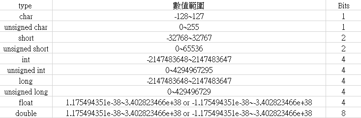

# Chpater1

*文章內程式碼若是遇到 "//" 表示為註解，單純解釋功能並不會影響程式執行*

## 基本宣告
最基本的C程式會是如下  
```c
int main(void)
{
	return 0;
}
```
或者  

```c
void main(void)
{
}
```

[c code 1] `int`代表這個函式會回傳一個整數行態的值,`main(void)`中的`void`表示這個函式不需要任何參數  
[c code 2] `void`代表這個函式不會傳回任何數值  

C語言本身提供了一些最基本的數值儲存型態  



宣告就是跟電腦要求一塊記憶體空間  

測試代碼: [chapter1-1.c](https://github.com/yuhioh217/Code-Tutorial/tree/master/C%20tutorial/Chapter1/chapter1-1.c)


## 輸出 output (printf)

從電腦發出訊息的功能稱做為`output`, C語言的stdio.h中有提供最簡單的printf輸出函式  

```
#include<stdio.h>

void main(void)
{
	printf("hello world\n");
	//透過printf, hello world將會被打印出來, \n是換行符號
	//在printf中，兩個雙引號中間的東西叫做字串
	//記住在C/C++的程式裡每一行程式的結束都要加入分號 ";"
}
```

測試代碼: [chapter1-2.c](https://github.com/yuhioh217/Code-Tutorial/tree/master/C%20tutorial/Chapter1/chapter1-2.c)

printf輸出函示也可以打印出宣告的參數, 透過在字串內定義打印的格式, 再進一步餵入想印出並且符合格式的參數

```
int main(void)
{
   int i = 20;    //declare the integer type parameter.
   char _c = 'A'; //notice that the naming rule can use the "_" in the star of the string.
   char *s = "apple"; //declare the char*(string) type s

   printf("Integer \"i\" is %d\n", i);
   printf("Character \"_c\" is %c\n" , _c);
   printf("String \"s\" is %s\n", s);

   return 0;
}

```

測試代碼: [chapter1-2.c](https://github.com/yuhioh217/Code-Tutorial/tree/master/C%20tutorial/Chapter1/chapter1-3.c)


Authors
-
Copyright(c) 2017 KE Jiang<<yuihoh217@gmail.com>>
