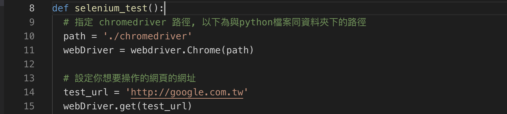
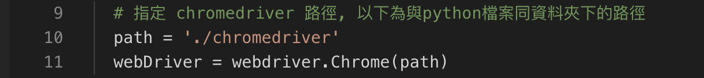
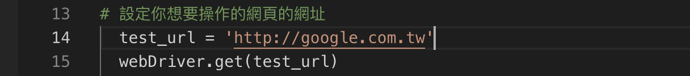
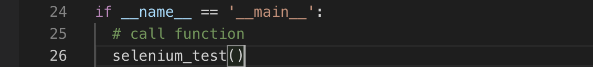

# Selenuim - chapter1

本課程預設你已經對python以及html有一定能力

文章內程式碼若是遇到 "#" 或者 "```" 表示為註解，單純解釋功能並不會影響程式執行

## 基本安裝
* Latest version selenium module doesn't support PhantomJS any more.
  Firefox and google chrome now support no header mode, so we can select one of both to use.

* 根據電腦上的chrome版本選擇相對應的chrome driver version : [Download](https://sites.google.com/a/chromium.org/chromedriver/downloads)

* 至於python部分則需要安裝Selenium模組

```python
pip install selenium 
或
pip3 install selenium
```


## 操作流程

Step1. 創建一個function，名稱為selenium_test



Step2. 使用Selenium模組需要配置瀏覽器套件



Step3. 設定操作的網址



Final Step. Call Function in main entry point




Authors
-
Copyright(c) 2017 KE Jiang<<yuihoh217@gmail.com>>
